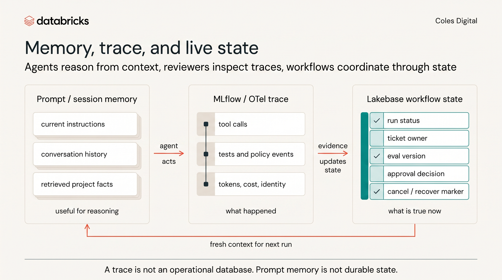

# Trace Review Worksheet

Use this whenever a team wants credit for a draft PR, guardrail proof, or triggered dispatch. The trace is not decorative audit exhaust; it is evidence for the review decision.



If you use a reviewer sub-agent, start from `02-reviewer-subagent-template.md` and attach its findings here. The reviewer sub-agent can help structure the audit, but the human team still owns the accept / send back / reject / escalate decision.

## 1. Identify The Run

| Field | Value |
|---|---|
| Team |  |
| Ticket id |  |
| Brief id or brief link |  |
| Agent |  |
| Model |  |
| Trigger type | Manual / scheduled / repo event / webhook / heartbeat |
| Named identity |  |
| Operating envelope |  |
| Trace link or artifact |  |

If the trace does not identify the ticket, brief, identity, and outcome, treat it as weak evidence.

## 2. Match Trace To PR

| Evidence | Value | Pass? |
|---|---|---|
| Draft PR link or diff link appears in trace |  | Yes / no |
| Branch or changed files match the PR |  | Yes / no |
| Test command appears in trace |  | Yes / no |
| test output/result matches the PR claim |  | Yes / no |
| Reviewer sub-agent or human review decision appears |  | Yes / no |
| Reviewer finding references diff, tests, scope, safety, and trace |  | Yes / no |

Decision rule: if the trace and PR tell different stories, stop and investigate before accepting the PR.

## 2a. Evaluation Checks

Evaluation is broader than validation. Validation checked whether the context
was safe to plan from before dispatch. Evaluation checks whether the completed
run is acceptable.

| Evaluation Mechanism | What It Proves | Evidence | Pass? |
|---|---|---|---|
| Targeted tests | PPCS behavior matches the ticket acceptance criteria |  | Yes / no / not applicable |
| Semgrep/static check | Repeated code-shape risks are absent or caught |  | Yes / no / not applicable |
| Trace trajectory review | Agent used approved tools, identity, execution/policy scope, and stop conditions |  | Yes / no |
| Reviewer rubric | A senior engineer accepts correctness, maintainability, scope, and policy risk |  | Yes / no |

If tests pass but trace or reviewer evaluation fails, do not accept the PR.
Green tests are necessary evidence; they are not the whole evaluation.

## 2b. Trace Completeness Gate

Before scoring the run, check whether the trace is complete enough to support
the claim. A polished PR with a thin trace is still weak evidence.

| Required Field | Evidence | Present? |
|---|---|---|
| Root trace or span id |  | Yes / no |
| Ticket id and brief id |  | Yes / no |
| Initiating human or trigger source |  | Yes / no |
| Acting identity |  | Yes / no |
| Parent/child tool spans |  | Yes / no |
| Guardrail, policy, or denial spans if claimed |  | Yes / no / not applicable |
| Test, static-check, or CI span |  | Yes / no |
| Draft PR, diff, or review artifact link |  | Yes / no |
| Token, cost, or cache fields when available |  | Yes / no / not available |
| Redaction evidence for sensitive fields |  | Yes / no / not applicable |
| Release-readiness packet if claiming deploy readiness |  | Yes / no / not applicable |
| Explanation for any missing span |  | Yes / no / not applicable |

If ticket id, acting identity, tool calls, tests/checks, PR artifact, guardrail
events, or cost fields are missing, cap the run as weak evidence even if the
diff looks good.

## 3. Inspect Tool Calls

| Tool Call | Target | Result | In Envelope? |
|---|---|---|---|
|  |  | allowed / denied / failed | Yes / no |
|  |  | allowed / denied / failed | Yes / no |
|  |  | allowed / denied / failed | Yes / no |
|  |  | allowed / denied / failed | Yes / no |

Look for:

- Approved repo reads and edits.
- Approved tests or checks.
- Governed MCP calls under the right identity.
- Denied actions that prove the guardrail works.
- Suspicious access to secrets, unapproved repos, ungranted data, deployment tools, merge tools, or raw egress.

## 4. Check Data And Telemetry Safety

| Question | Evidence | Pass? |
|---|---|---|
| Does the trace avoid raw promo/customer/member payloads? |  | Yes / no |
| Are sensitive fields redacted or absent downstream? |  | Yes / no |
| Are prompts, credentials, tokens, or connection strings absent? |  | Yes / no |
| Are telemetry fields useful without being excessive? |  | Yes / no |

If sensitive data appears in trace or logs, reject the PR or mark the guardrail proof as failed. Do not rationalise it as "just debug output."

## 5. Review Cost And Context

| Signal | Value | Interpretation |
|---|---:|---|
| Input tokens |  |  |
| Output tokens |  |  |
| Cache-read tokens |  |  |
| Estimated cost |  |  |
| Number of tool calls |  |  |
| Number of files touched |  |  |

Cost alone is not the score. Ask whether the cost produced governed value:

- Small accepted PR: good.
- Large rejected diff: expensive lesson; codify it.
- Many turns with no reviewable artifact: tighten context and stop conditions.

## 6. Decide

Choose one.

| Decision | When To Use |
|---|---|
| Accept | Trace, diff, tests, and review decision align; no envelope violation. |
| Send back | Scope is safe, but correctness, tests, or evidence are insufficient. |
| Reject | The run crosses the operating envelope or leaks sensitive information. |
| Escalate | The ticket appears valid but requires new access, data, tool scope, or policy approval. |

Decision:

```text
Accept / send back / reject / escalate

Reason:

Reviewer sub-agent finding, if used:

Evidence:

Next brief or guardrail change:
```

## 7. Minimum Trace Bar

A trace is strong enough for workshop scoring when it shows:

- Ticket id or brief id.
- Agent and model.
- Named identity or team identity.
- Approved repo/tool/data scope.
- Tool calls and results.
- Test command and outcome.
- Draft PR or review artifact.
- Reviewer decision or guardrail event.
- Cost or token signal when available.

A trace is weak when it only says "agent ran" or "task completed." Weak traces can support discussion, but they should not carry scoring by themselves.
