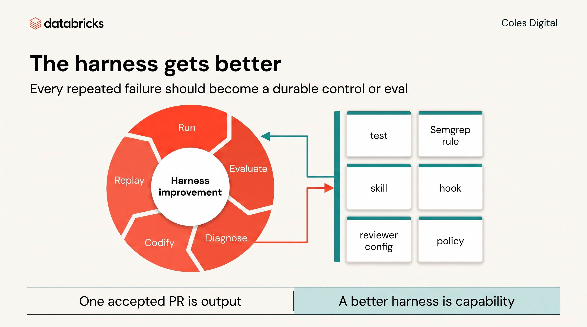

# Loop Engineering Handout

Loop engineering is the discipline of designing the repeatable agent workflow, not just writing a better prompt.

In this challenge, the unit of work is not "agent wrote code." The unit of work is a governed loop that starts with a ticket and ends with a reviewed PR, trace evidence, and a reusable lesson.

## R.V.P.I.

Use R.V.P.I. inside every loop:

| Step | What It Means Here |
|---|---|
| Research | Gather only the repo files, ticket context, approved Databricks objects, prior traces, and policy notes needed for the ticket. |
| Validate | Check that the context is current, consistent, and inside the operating envelope before planning from it. |
| Plan | Clarify ambiguity, then ask for a small plan with files, tests, stop conditions, and evidence before implementation starts. |
| Implement | Execute one reviewable change, then verify it with tests, trace evidence, and PR review. |

Validate is the step that prevents stale memory, wrong repo assumptions, poisoned
context, or plausible-but-unsupported research from becoming a confident bad
plan.

## Validate Versus Evaluate

Do not use these words interchangeably.

**Validate happens before planning.** It asks whether the inputs are safe to
reason from:

- Is this ticket current?
- Are these files the right files?
- Is this memory stale or contradicted by the repo?
- Is the requested data/tool access inside the envelope?
- Are the assumptions explicit enough to plan from?

**Evaluate happens after the agent acts.** It asks whether the output and the
trajectory meet the bar:

- Did the service behavior pass targeted tests?
- Did a static check such as Semgrep catch repeated risky code shapes?
- Did the trace show the right tools, identity, execution/policy scope, and stop
  conditions?
- Did the reviewer rubric catch correctness, maintainability, policy, and
  business-rule risks?
- Should this accepted/rejected run change the harness?

In short: validate the **context** before the plan; evaluate the **run** before
acceptance.

## Clarify Before Implementing

Ambiguity is part of the loop. Do not let the agent turn unclear requirements
into confident implementation.

First pattern to notice: AI moves the hard work earlier. Before dispatch, the
engineer has to decide what the rule means, where the boundaries are, what
evidence will count, and when the agent must stop.

Before dispatch, ask one to three clarifying questions or write the assumptions
the agent must follow. A usable plan names:

- intended files;
- API/data shape or UI behavior;
- tests and evidence;
- stop conditions;
- the human decision point.

If the room cannot answer an ambiguity, continue only with explicit assumptions
and the smallest reversible draft PR. This checkpoint limits scope; it does not
let the agent broaden access, merge, deploy, or skip review.

## Specifications Need Executable Feedback

Specifications create shared intent. They are valuable, but they are not enough
on their own. If a specification leaves room for interpretation, the agent will
fill the gap.

Turn important parts of the specification into executable feedback:

- Business behaviour becomes tests.
- Architecture rules become dependency checks or reviewer criteria.
- Data and tool boundaries become governed MCP, Unity Catalog, and operating
  envelope controls.
- Unsafe patterns become static checks, hooks, or reviewer configs.
- Repeated human corrections become durable agent-loop improvements.

Use this test: if the team would reject a PR for violating the rule, decide
where that rule should live before the next dispatch.

## The PPCS Loop

| Step | Question | Artifact |
|---|---|---|
| Intake | What is the ticket asking for, and what is out of scope? | Ticket id, acceptance criteria, operating-envelope notes |
| Brief | What trigger, context, and steerability does the agent need? | Dispatch brief |
| Dispatch | Did the agent run inside approved repo/tool/data scope? | Branch, logs, trace |
| Observe | What did it touch, test, block, and spend? | MLflow/OTel trace, test output |
| Evaluate | Did tests, Semgrep/static checks, trace review, and reviewer rubric agree? | Test output, `make guardrails`, trace worksheet, review notes |
| Review | Would a senior engineer approve this? | Review decision, comments |
| Govern | Did anything cross or pressure the envelope? | Trap finding, guardrail proof |
| Codify | What should the next dispatch inherit? | Skill, reviewer config, runbook note, test |
| Measure | Is the harness getting better? | Accepted PR rate, rework, defects, guardrail hits, cost |

## Guardrails Are Review Feedback Moved Into The System

Guardrails are not only security blocks. In this workshop, a guardrail is any
repeatable feedback mechanism that keeps the agent inside the intended delivery
loop.

Good guardrails are close to where the agent works, cheap to run, and specific
enough to correct from. They should say what failed and what pattern is
expected.

Examples:

- Test: "Multi-buy offers without explicit quantity and bundle price are invalid."
- Static check: "Do not add default values to validator function parameters."
- Semgrep rule: "Do not log raw promo payloads or call raw outbound HTTP."
- Hook: "A validator changed without a matching test."
- Reviewer config: "Check that UI code does not call persistence directly."
- UC/MCP policy: "This identity cannot read restricted margin data."
- Trace check: "Telemetry must contain event id and rule id, not raw promo payload."

## Goal Anchors

For a long-running or multi-criteria backlog item, write a short goal anchor
before dispatch. The goal anchor is the persistent objective the agent should
keep returning to when context grows or the thread runs for a while.

A good goal anchor includes:

- the ticket or backlog outcome;
- acceptance criteria and stop conditions;
- approved repo, data, and tool scope;
- evidence required before the work can be considered done;
- the human decision point.

Do not use a goal anchor to widen autonomy. It keeps the agent oriented; it
does not let the agent merge, deploy, broaden access, or skip review.

## Trigger / Context / Steerability

Every useful agent loop answers three questions.

Trigger:

- Manual dispatch now.
- Schedule.
- GitHub event.
- Webhook.
- Heartbeat: a same-thread interval monitor that watches evolving state, such
  as PR review comments or failed checks, and stages a draft response for human
  review. It never merges, deploys, or broadens access on its own.

Context:

- Approved repo/path.
- Ticket and acceptance criteria.
- Relevant tests and docs.
- Approved Databricks objects and MCP tools.
- Explicitly excluded files, data, endpoints, and actions.

Steerability:

- Reviewer sub-agent or critique lens.
- Tests/checks to run.
- Evidence to return.
- Stop conditions.
- Human decision point.

## What Good Looks Like

Good loop:

- One ticket.
- One brief.
- One small branch.
- Draft PR only.
- Trace captured.
- Tests aligned to acceptance criteria.
- Human review before acceptance.
- Repeated failure codified.

Bad loop:

- "Fix the whole backlog."
- Agent reads everything.
- Long session with stale context.
- Human side questions are mixed into the active implementation thread until
  the agent loses the ticket boundary.
- Huge diff.
- Summary trusted without diff review.
- Raw egress, secrets, broad grants, or deploy actions hidden in the implementation.
- No trace or evidence pack.

## Side Investigations

If a human has a question while an agent run is active, investigate it in a
separate note, side thread, or reviewer sub-agent. Do not silently steer the
active implementation run with unrelated context.

Only feed the result back into the main dispatch by updating the brief, adding a
review comment, or recording a new stop condition. If the side investigation
changes the ticket boundary, stop and re-plan.

## Codify With The Smallest Scalable Mechanism

When a failure repeats, choose the lightest mechanism that will prevent it next
time:

| Mechanism | Best Use | Scaling Cost |
|---|---|---|
| Brief line | One ticket or one narrow dispatch | Paid only in that dispatch |
| Skill or reviewer config | Repeatable workflow or critique lens | Short description is always loaded; body is pay-per-use |
| Post-tool-use hook | Overridable quality nudge, like a red squiggly for generated files, missing tests, or unsafe logging patterns | Zero token cost until it fires |
| Semgrep rule | Repeated code-shape finding such as unsafe logging, raw outbound HTTP, broad exception swallowing, or hidden defaults | Cheap local static check; good agent feedback when the message is specific |
| Governed MCP / UC policy | Containment boundary for repos, data, secrets, egress, or identity | Hard platform block, not optional advice |
| Sub-agent | Noisy research, log review, browser QA, security critique, or staff-engineer review | Separate context with a small parent description |

Use tests for behavior. Use Semgrep, hooks, and reviewer configs for quality
feedback. Use governed MCP, Unity Catalog, execution scope, and platform policy
for containment. A hook or Semgrep rule can warn or fail local checks; it must
not replace the hard block that prevents ungranted data access, secret exposure,
raw egress, merge, or deploy.

Compatibility line for the current rehearsal checker: Use hooks and reviewer configs for quality feedback; they must not replace the hard block.

## The Cost Angle

Agents are stateless. Long sessions keep re-reading large contexts. Caching helps, but it does not make sprawling work free.

Lean loops are cheaper and safer because:

- Fewer tokens stay in context.
- Fewer turns re-read irrelevant history.
- Smaller diffs are easier to review.
- Traces are easier to interpret.
- Failures are easier to isolate.

## The Governance Angle

The operating envelope is part of the loop. Do not bolt it on after the PR.

The loop should make unsafe actions visible early:

- Unapproved repo access.
- Ungranted Unity Catalog reads.
- Secret access.
- Raw outbound egress.
- Sensitive telemetry.
- Autonomous merge/deploy.

Finding and stopping those actions is successful engineering work.
