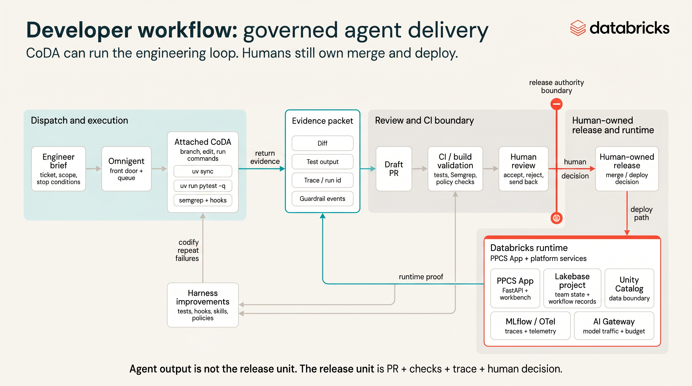

# Contributing & Team Coordination — PPCS Challenge

This repo is the shared coordination space for all teams building against the
**Promotional Pricing Compliance Service (PPCS)** backlog during the CoDA
Engineering Challenge (Monday 13 July 2026). You dispatch CoDA agents against
this repo, review their draft PRs, and govern what is safe to accept.

Read `README.md` first for the challenge framing, then `START-HERE.md` and
`00-participant-guide.md` for how a team actually works a ticket.



## Teams

- ~10 teams of 2–3 engineers (`team-01` … `team-10`).
- Each team owns a long-lived branch named after it: `team-01`, `team-02`, …
- `main` is protected and shared. Nobody pushes directly to `main`.

## Branch model

**Live scoring depends on branch names.** The facilitator PR autoscorer attributes
each draft PR to a team by parsing the **head branch** (not the PR title or body).
Keep the `team-NN` prefix on every branch you push and every PR you open.

### Required convention

| Part | Rule | Example |
|---|---|---|
| Team prefix | `team-` + two-digit number (`01`…`10`) | `team-03` |
| Integration branch | Exactly `team-NN` off `main` | `team-03` |
| Per-ticket branch | `team-NN/PPCS-XXX-short-slug` | `team-03/PPCS-001-fix-discount-rounding` |
| Ticket id in branch | Include `PPCS-NNN` (helps ticket detection) | `…/PPCS-004-invalid-price-inputs` |

Recognized variants (still scored to the same team): `team03`, `team_07`,
`coda-team-4-ppcs-001`. **Not recognized:** branches with no `team-NN` token
(e.g. `ppcs-001-fix`, `feature/my-fix`) — those land in **Unknown team** on the
live board until a judge reassigns them.

```
main  (protected, shared baseline)
 ├── team-01              ← your team's integration branch
 │    └── team-01/PPCS-004-invalid-price-inputs   ← per-ticket working branch
 ├── team-02
 │    └── team-02/PPCS-009-member-price-disclosure
 └── ...
```

1. Your team starts from its `team-NN` branch (already created off `main`).
2. For each ticket, a CoDA agent branches off `team-NN` as
   `team-NN/PPCS-XXX-short-slug`, edits, runs tests, and opens a **draft PR**
   **into `team-NN`** (base = your integration branch, head = the prefixed
   ticket branch above).
3. The senior engineer **reviews the queue** — accept / reject / send back —
   *with reasons*. Merge accepted work into `team-NN`.
4. Keep `team-NN` green (baseline is 6 pass / 1 intentional PPCS-001 failure).

**Check before opening the PR:** `git branch --show-current` shows
`team-NN/PPCS-…` (or you are intentionally PRing from `team-NN`). Wrong branch
name = your team's points do not roll up automatically.

You do **not** merge into `main` during the workshop — `main` stays the clean
shared baseline so every team starts from the same place and cross-team diffs
stay readable.

## Pull requests

- Open PRs as **draft** first; that is the review surface.
- Use the GitHub PR template (auto-loaded when you open a pull request).
- Every PR must state its **Trigger / Context / Steerability** and link the
  dispatch trace. Catching a trap beats shipping a feature — call it out.
- Do not commit secrets, tokens, deploy config, or env files. Gitignore blocks
  the common ones; stay alert anyway.

## Your team's database (Lakebase)

Each team gets its own Lakebase branch + schema, pre-seeded with the tables the
backlog uses. See `LAKEBASE.md` for how to connect (no secrets — credentials are
minted per connection) and how the autoscaling exercise works.

For the full deployment map (shared compute, shared CoDA workspace storage, CI
branches), read `LAKEBASE-DEPLOYMENTS.md`. Before dispatching:

- Run `gh auth switch` so the active GitHub account matches the workshop repo.
- Use a **git worktree** per ticket branch so CoDA sync writeback from App local
  storage to the Databricks Git folder lands on the correct branch.

## Running the service locally

```bash
cd service && uv sync && uv run pytest -q   # baseline: 6 pass, 1 intentional PPCS-001 failure
uv run uvicorn app.main:app --reload         # UI at http://localhost:8000/ , API docs at /docs
```

## Evidence

Score claims go through the scoreboard flow, not raw commits — see
`ref-scoreboard.md` and `ref-evidence-submission-template.md`.

Opening a **draft PR from a correctly prefixed branch** (`team-NN/…`) is what
feeds the facilitator live scoreboard; you do not paste scores into this file
during the workshop.
