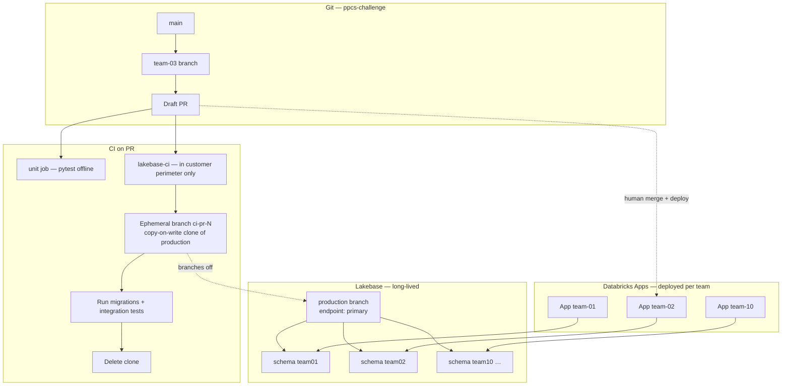

# Lakebase Deployments — production, apps, and branching

PPCS uses Lakebase for live state. Three names get conflated — this page keeps
them straight:

| Term | What it actually is |
|---|---|
| **Git `production`** | Not used — teams work on `team-NN` branches in `ppcs-challenge` |
| **Lakebase `production` branch** | The long-lived **database** branch (schemas + data) |
| **Databricks App deployment** | The running PPCS service your team hits in the browser |

Your team's **App** connects to a Lakebase **target** (branch + endpoint) and
writes only inside its **schema** (`team01` … `team10`).

## There is no dev database

This model will feel wrong if you expect **dev → staging → prod** as three
long-lived databases. PPCS does not work that way.

| What people expect | What PPCS actually has |
|---|---|
| Dev DB to hack on | **No** — implement in Git + offline tests (mocks / in-memory repos) |
| Staging DB to rehearse | **No** — optional ephemeral `ci-pr-*` clone for migration proof only, then deleted |
| Prod DB | **Yes** — Lakebase branch `production`, with per-team **schemas** |

**Only one long-lived database branch.** Teams do not get a private copy to
mutate while building. The facilitator pre-seeds your schema and tables before
the workshop; your tickets change **application code** (and sometimes a
**migration file**), not a standing dev environment.

```text
Build:   Git + pytest with fakes     (no Lakebase credentials)
Prove:   draft PR + unit CI           (still no live Lakebase)
Ship:    human deploys your App      (app connects to production + your schema)
Check:   /validate, lakebase-check   (first real DB traffic for many tickets)
```

Say this out loud in the room before Round 2 state tickets: *"You are not
editing a dev database. You are wiring code that will run against your schema
on production after deploy."*

## The full picture (runtime + CI)



### Read the diagram

1. **Git** — agents open draft PRs against your `team-NN` branch. The `unit` job
   runs pytest **without** live Lakebase (by design).
2. **Lakebase CI** (AzDO in-perimeter, or `ci/ci-branch-demo.sh` live) — cuts a
   **disposable branch off `production`**, runs migrations/tests on the clone,
   deletes it. You promote **migrations**, not branch data.
3. **`production` branch** — the workshop's long-lived Postgres. All team
   **schemas** live here (multi-tenant isolation).
4. **Databricks Apps** — one deployment per team (when provisioned). Each app is
   configured with `PPCS_LAKEBASE_TARGET` → `…/branches/production/endpoints/primary`
   and `PPCS_TEAM_SCHEMA` → `teamNN`. After a human accepts a PR, the facilitator
   (or approved process) **deploys** the app; the app then uses the existing
   Lakebase branch — it does not create one per ticket.

## Where Lakebase branching comes in

| When | Lakebase branching? | What happens |
|---|---|---|
| Every ticket / dispatch | **No** | App uses the already-provisioned target + your schema |
| PR `unit` job | **No** | Offline pytest + Semgrep |
| PR `lakebase-ci` (in perimeter) | **Yes** | Ephemeral `ci-pr-*` branch off `production` |
| Facilitator live demo | **Yes** | `./ci/ci-branch-demo.sh` — same cycle, narrated |
| Round 3 (optional layout) | **Maybe** | See alternate layout below |

**Lakebase branching is for validating schema change on a prod-shaped clone** —
not for carrying tenant data and not for day-to-day app traffic.

## Runtime layout (default — `production` + schemas)

This is what `CI-AND-PROMOTION.md` describes and what the live dry-run evidence
used:

```text
projects/ppcs-coda-challenge
└── branch: production          ← one long-lived DB
    └── endpoint: primary       ← shared compute endpoint
        ├── schema team01       ← Team 1 app (SP grants)
        ├── schema team02
        └── …
```

- **Isolation:** Postgres schema + app service principal grants (not separate branches).
- **App env:** `PPCS_LAKEBASE_TARGET=projects/ppcs-coda-challenge/branches/production/endpoints/primary`, `PPCS_TEAM_SCHEMA=team03`.
- **CI clone source:** `production` (all team schemas copied in the COW clone).

Smoke test:

```bash
curl -sS "<your-team-app-url>/platform/lakebase-check" -H "authorization: Bearer $TOKEN"
```

## Alternate runtime layout (lakemeter Round 3 — branch per team)

Some facilitator setups provision **one Lakebase branch per team** so each
team's Metrics dashboard shows only its own autoscaling curve (`provision_team_lakebase.py`
in the facilitator materials repo). That looks like:

```text
projects/ppcs-coda-challenge
├── branch team01 → endpoint primary → schema team01  ← Team 1 app
├── branch team02 → endpoint primary → schema team02
└── …
```

Same **schema name** pattern; different **branch + endpoint** per team. CI still
branches off `production` when that branch exists for migration testing — ask your
facilitator which layout is live in your workspace.

## End-to-end when a ticket touches state (e.g. PPCS-054)

```text
1. Brief → agent edits code on Git branch team-03
2. Draft PR → unit CI (no live Lakebase)
3. Optional: lakebase-ci clones production → migrates CI schema → tests → deletes clone
4. Human reviews diff + trace + CI
5. Facilitator / approved human deploys Databricks App for team 03
6. App connects to production (or team03 branch) + schema team03
7. Post-deploy: /validate, /platform/lakebase-check, Round 3 load if applicable
```

Schema and branch are **pre-provisioned**. Your PR only changes **application code**
to use them correctly (and adds migrations under `service/migrations/` for CI to
prove).

## Live demo script (facilitator or in-perimeter)

From a `ppcs-challenge` clone with Lakebase access:

```bash
export DATABRICKS_CONFIG_PROFILE=lakemeter   # or your workshop profile
./ci/ci-branch-demo.sh "ci-demo-$(date +%s)"
```

Shows: schemas in `production` → cut clone → mutate clone → `production` unchanged
→ delete clone.

## Related docs

| Need | File |
|---|---|
| CI promotion ladder | `CI-AND-PROMOTION.md` |
| Team sharing, grants, ticket guidance | `LAKEBASE.md` |
| App + autoscaling arc | `01-base-app-architecture.md` |
| Portable CI scripts | `ci/README.md`, `ci/lakebase_branch.py` |
| Git workflow | `CONTRIBUTING.md` |
