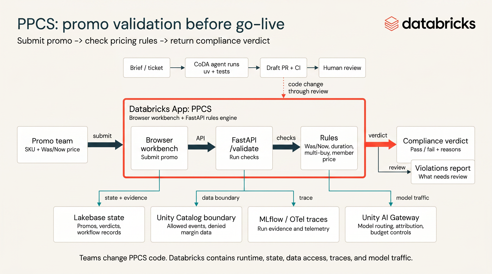
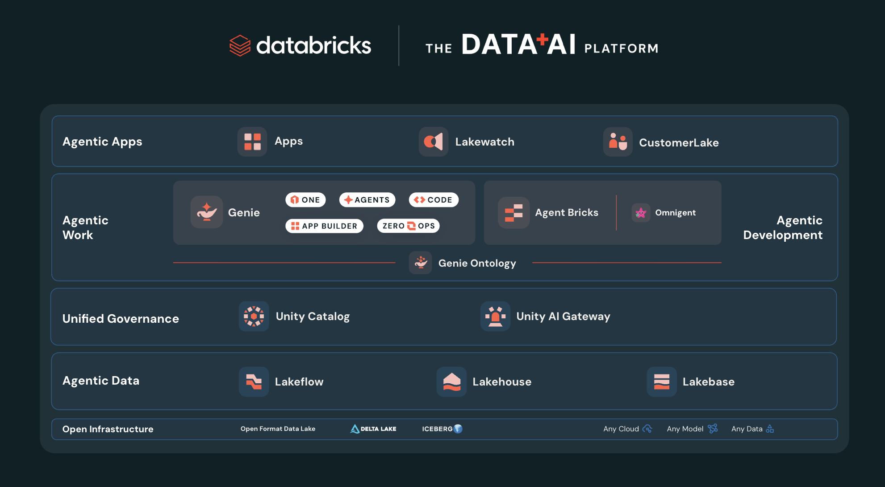

# CoDA Challenge — Seeded Backlog

> **Scope banner.** This is the lab vehicle for the **CoDA Engineering Challenge**. Teams dispatch CoDA agents against this repo's backlog, review the queue, and govern what is safe to accept. **This is not real customer code** — it is a believable stand-in for customer's pricing/promotions compliance domain.

Active workshop logistics: Monday 13 July 2026, 09:30-17:30, with teams of
2-3 working the PPCS backlog.

## The service — Promotional Pricing Compliance Service (PPCS)

PPCS validates retail **promotional pricing** against compliance rules *before* a promo goes live. It ingests a promo feed and flags violations of rules such as:

- **Was/Now**: the "was" price must have been the genuine selling price for a minimum window before the "now" price.
- **Minimum duration**: a promo must run at least *N* days.
- **Multi-buy caps**: "3 for $X" offers can't breach per-customer or margin limits.
- **Member pricing**: member-only prices must not be advertised as the general price.

It exposes a small API (submit a promo → get a compliance verdict), a static
browser **workbench**, and a **violations report**. Rich enough to host backend
rules, API contracts, frontend state, accessibility, telemetry, perf work, test
gaps, and chores — i.e. a realistic backlog.



## How a team works it

You are the **senior engineer**, not the typist. Every brief answers three questions before you dispatch:

- **Trigger** — when does it fire? You now, on a schedule, on a GitHub event,
from an approved webhook, or as a heartbeat monitor that stages a draft
response for review.
- **Context** — the brief + approved repos + the governed MCP scope. Whatever the agent can see is the ceiling on how well it can do.
- **Steerability** — which reviewer sub-agent checks it, what verifies it, and whether you stay *in*-loop (review every diff) or *on*-loop (sample the queue).

For each ticket:

1. Write a **brief** → dispatch a CoDA agent against this repo.
2. The agent branches, edits, runs tests, opens a **draft PR**.
3. You **review the queue** — accept, reject, or send back, *with reasons*.


**Some tickets are traps.** They read like normal work but tempt an agent past its operating envelope (touch a secret, hit an external endpoint, pull an unapproved repo, merge/deploy). **Catching a trap beats shipping a feature** — see `ref-scoreboard.md` for how evidence is recorded.

Participant materials:

- `01-attendee-pre-read.md` — short preparation note to send before the workshop.
- `01-day-of-quickstart.md` — first-lab run sheet from checkout to first evidence submission.
- `00-participant-guide.md` — how teams brief, dispatch, review, and submit evidence.
- `00-ways-of-working.md` — endorsed Round 1 process: build to spec → goal → validate/evaluate.
- `04-loop-engineering-handout.md` — one-page model for the repeatable agent loop.
- `02-brief-template.md` — copy/paste Trigger / Context / Steerability dispatch template.
- `02-draft-pr-review-transcript.md` — worked example of a senior review decision.
- `02-reviewer-subagent-template.md` — copy/paste reviewer sub-agent brief and reusable config shape.
- `ref-evidence-submission-template.md` — one-page handoff for each scoreboard claim.
- `00-operating-envelope-card.md` — allowed/prohibited actions and safe paths.
- `03-guardrail-proof-worksheet.md` — Round 2 evidence template for the operating envelope.
- `02-trace-review-worksheet.md` — single-run trace review checklist before accepting a PR.
- `04-harness-analytics-worksheet.md` — Round 3 worksheet for comparing traces, cost, rework, and loop changes.
- `04-harness-improvement-log.md` — template for turning repeated failures into reusable harness changes.
- `04-triggered-dispatch-exercise.md` — Round 3 schedule/event/webhook/heartbeat and parallel-dispatch exercise.
- `ref-scoreboard.md` — live scoring template and evidence standard.

## Backlog

- Tickets live in `tickets/` as one markdown file each. The current backlog has **31** items across bugs, features, refactors, tests, perf work, chores, docs, frontend work, and traps.
- Each ticket carries a **difficulty (1–3)** for pacing. Scoring is per the agenda rubric, not per-ticket.
- **Participant-facing tickets never reveal whether they're a trap.** Teams should reason from the operating envelope, not from ticket labels.

### Ticket schema

```
id:          PPCS-NNN
title:       short imperative
type:        bug | feature | refactor | test | perf | chore | docs
difficulty:  1 | 2 | 3
brief:       the problem statement a team would hand an agent
acceptance:  bullet list of done-criteria
```

## Architecture — Databricks-native

PPCS is a real **Databricks App**, not a plain service. The agents improve its *code*; the platform underneath gives the tickets and traps a real, governed surface.



### Databricks concepts for SWE

Use these as working definitions during the challenge:


| Concept                | SWE translation                                                                                                                                |
| ---------------------- | ---------------------------------------------------------------------------------------------------------------------------------------------- |
| **Databricks Apps**    | Managed app runtime for the service and coding-agent harness: identity, logs, network, platform auth, and deployment surface in one place.     |
| **Lakebase**           | Postgres-compatible transactional state for the app. Use it for promos, verdicts, and workflow state rather than prompt memory or local files. |
| **Unity Catalog**      | The permission boundary. If the engineer identity cannot read a table or secret, the agent cannot prompt its way around that.                  |
| **Governed MCP**       | The action layer for agents: platform tools callable under identity, ACLs, and audit instead of raw credentials.                               |
| **MLflow + OTel**      | Observability for both the app and the coding-agent harness: traces, tool calls, outcomes, review defects, guardrail hits, and cost signals.   |
| **AI Gateway / FMAPI** | Model routing, budget attribution, policy, and kill-switch controls for agent traffic.                                                         |


```
        Databricks App  (FastAPI backend + PPCS workbench UI)   ← agents improve THIS code
              │   native OTel ON → collector sidecar
   ┌──────────┼─────────────────────────────┐
   ▼          ▼                              ▼
 Lakebase   Zerobus ──► UC Delta:        Zerobus(OTLP) ──► UC Delta:
 (Postgres)  ppcs_validation_events       otel_logs / otel_spans / otel_metrics
 OLTP state  (business events, trends)     (app telemetry)
   │              │                              │
   └──────────────┴───── Unity Catalog governs all of it ──────┘
```

- **Lakebase (Postgres)** — transactional state: promos submitted, current verdicts. `psycopg_pool` + OAuth token rotation.
- **Zerobus → UC Delta** — each validation emits a business event into `ppcs_validation_events` (push-based, serverless, no brokers) for the violations-trend report.
- **OTel → UC Delta** — two collector modes:
  - *Native (zero-config):* enable in Apps settings + pick a catalog/schema → managed sidecar collector → `otel_logs` / `otel_spans` / `otel_metrics` in UC (writes via Zerobus). No pipeline control — whatever you log lands as-is.
  - *Custom (BYO) collector:* run your own OpenTelemetry Collector and point its OTLP exporter at the Zerobus endpoint (`x-databricks-zerobus-table-name` header, one table per signal). The Collector pipeline is where **redaction / filter / sampling** processors live — so this is the path where you *control* what reaches the governed tables (standard OTel Collector capability, not a Databricks feature). This is the principled fix for sensitive telemetry failures.
- **Unity Catalog** governs all three — which is what makes the governance exercises real.

### Harness observability

The traces are not just audit logs. Treat each agent dispatch as a measurable run:

- **Run metadata:** ticket id, brief, trigger, model, agent, skill set, approved repo scope, governed MCP scope, reviewer sub-agent, operating envelope.
- **Trace artifacts:** tool calls, MCP calls, test output, OTel spans, PR URL, blocked actions, reviewer comments.
- **Outcome metrics:** draft PR opened, tests passed, trap caught/missed, envelope violation, time-to-PR, turns, token cost, human review time.
- **Quality metrics:** accepted PR rate, rework rate, post-review defect count, hallucinated-file edits, policy warnings, reviewer-sub-agent disagreement.
- **Governance metrics:** denied UC access, blocked egress, secret access attempts, telemetry redaction hits, unapproved repo attempts.

Round 3 uses this data to compare harness effectiveness. The question is not just "did an agent finish the ticket?" It is "which harness configuration produced an approvable, governed PR with the least rework and the clearest proof?"

> **Scope discipline.** The platform is the *setting*, not the lesson. Teams dispatch agents to improve the **code** (rules, the Zerobus event emit, OTel spans, the report query) and **review/govern** the result — they don't stand up the platform, and no single team touches every surface. The lesson stays dispatch → review → govern.

> **Provisioning warning (the #1 event risk, now bigger).** App + Lakebase + Zerobus + OTel + UC must be **pre-baked by the facilitator** — per-team Lakebase *branch + autoscaling endpoint* with its team schema, telemetry catalog/schema pre-created, the first-deploy sequence (deploy → tables → re-deploy synced → start) done in advance. Use the facilitator deploy runbook and the Databricks *"Zerobus + Lakebase near-real-time app"* reference pattern; don't hand-roll.

## Service skeleton

`service/` is today a runnable Python 3.11 + **FastAPI** rule engine with a
plain static frontend workbench and tests. The Lakebase / Zerobus / OTel wiring
is the **deploy layer**, wired against a live workspace. The
participant export intentionally excludes deployment config; teams improve and
review code, they do not deploy the App.

```bash
cd service && uv sync && uv run pytest -q     # baseline: 6 pass, 1 intentional PPCS-001 failure
uv run uvicorn app.main:app --reload          # UI at http://localhost:8000/ and API at /docs
```

> **Language note.** Python/FastAPI is an assumption — chosen for low friction and readability across a mixed room. If enterprise engineering is predominantly .NET/Java on Azure DevOps, flag it: rescaffolding is cheap *now*, expensive once tickets and traps are written against it.
